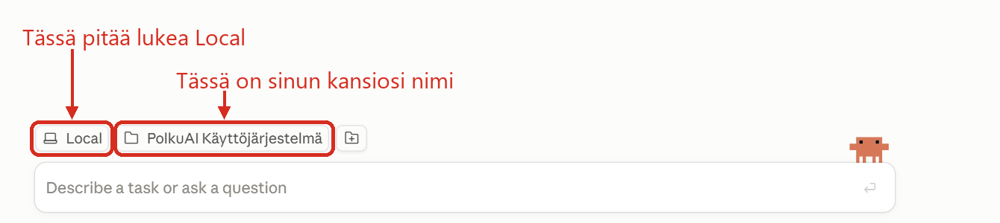

# Yrittäjän AI-käyttöjärjestelmä

Opas alusta loppuun. Asennus on kolme askelta ja vie noin viisi minuuttia.

---

## 1. Mikä ongelma tässä ratkaistaan

Sä käytät varmaan jo tekoälyä. Avaat keskustelun, selität tilanteen, saat vastauksen. Seuraavana päivänä avaat uuden keskustelun ja selität saman tilanteen uudestaan.

Se selittäminen on se ongelma. Se maksaa muutaman minuutin joka kerta ja tekee vastauksista yleisiä. Assistentti ei tunne sun hinnoittelua, asiakkaita eikä kirjoitustyyliä, joten se antaa neuvoja jotka sopivat kenelle tahansa.

Tämä paketti korjaa sen. Se on kansio tekstitiedostoja, joissa lukee kuka sä olet, mitä sä myyt, kenelle ja millä tyylillä sä kirjoitat. Assistentti lukee ne joka kerta automaattisesti.

### Mukana tulee viisi valmista skilliä

Skilli on tekoälylle kirjoitettu työohje. Siinä lukee mitä tehdään, missä järjestyksessä, mitä kysytään, mihin tiedostoon tulos kirjoitetaan ja mitä ei saa tehdä. Sinun ei tarvitse tietää siitä mitään, koska sä käynnistät sen yhdellä sanalla.

Sana alkaa kauttaviivalla, esimerkiksi `/aloita`. Kirjoitat sen tavalliseen viestikenttään kuten minkä tahansa viestin. Assistentti tunnistaa sanan, avaa oikean työohjeen ja vie homman läpi alusta loppuun ilman että sun tarvitsee ohjata sitä joka välissä.

Ero tavalliseen pyyntöön on siinä, että lopputulos on joka kerta samanlainen. Kun kirjoitat `/tarkista`, saat aina saman rakenteen ja samat mittarit, etkä sitä mitä assistentti sattuu sillä kertaa keksimään.

| Skilli | Mitä tekee | Milloin |
|---|---|---|
| `/aloita` | Haastattelee sinut ja täyttää pohjat. Käyttöönotto | Ensimmäisenä päivänä |
| `/syvenna` | Kaivaa yhden asian päästäsi tiedostoon kysymys kerrallaan | Kun jokin iso asia on vain omassa päässäsi |
| `/linkita` | Lisää uuden kansion, projektin tai lähteen assistentin löydettäväksi | Kun otat jotain uutta käyttöön |
| `/tarkista` | Auditoi järjestelmän, pisteyttää sen ja nimeää kehityskohteet | Aina kun haluat tietää missä mennään |
| `/kehita` | Näyttää mitkä parannukset kannattavat eniten suhteessa vaivaan, ja rakentaa valitsemasi | Aina tarkistuksen jälkeen |

Nämä kaksi viimeistä kulkevat parina. `/tarkista` kertoo mikä ontuu, `/kehita` näyttää mistä kannattaa aloittaa ja tekee sen.

**Mitä tämä ei ole.** Ei ohjelma eikä sovellus. Ei omia tunnuksia eikä pilvipalvelua. Kansio, jonka jokaisen tiedoston sä voit avata ja lukea.

**Mihin tämä perustuu.** Toimiva järjestelmä koostuu neljästä kerroksesta. **Tieto** eli se tuntee sun firman, **Työkalut** eli se yltää sinne missä sun tieto on, **Taidot** eli se osaa tehdä sun työsi vaiheet ja **Tahti** eli se toimii ilman että pyydät. Tieto on aina ensin ja Tahti aina viimeisenä.

---

## 2. Mitä tarvitset

**Claude Pro -tilaus, 20 dollaria kuussa.** Noin 19 euroa. Se sisältää Claude Coden, joka on se osa Claudea joka osaa lukea koneesi kansioita. Ilmaisversio ei riitä eikä kalliimpaa Max-tilausta tarvita.

**Claude Code jommalla kummalla tavalla.** Työpöytäsovellus on helpompi, ja tämä opas neuvoo sen. Lataa se osoitteesta claude.ai/download. Jos olet tottunut komentoriviin, Claude Code toimii myös terminaalissa, ja silloin komennot ja kansio ovat täsmälleen samat. Selain ei käy, koska se ei näe sun koneen kansioita.

**Noin viisi minuuttia asennukseen.** Sen jälkeen assistentti haastattelee sinut, ja siihen menee vartista puoleen tuntiin.

Ohjelmointitaitoa ei tarvita.

---

## 3. Asennus

Sun ei tarvitse ladata mitään eikä purkaa mitään. Assistentti kasaa kansion puolestasi.

**1. Luo koneellesi uusi kansio.**

Nimeä se miten haluat. Tärkeää on vain se, että kansio on **sinun koneellasi eikä pilvipalvelussa**. Älä siis luo sitä OneDriveen, Dropboxiin, iCloudiin tai Google Driveen. Synkronointi ja tiedostojen jatkuva muokkaus tekevät yhdessä tyhmyyksiä, ja tiedostoja voi kadota kesken kaiken.

Turvallisia paikkoja ovat esimerkiksi työpöytä tai Tiedostot-kansio, kunhan niitä ei ole kytketty pilveen.

**2. Avaa kansio Claude Codessa.**

Avaa Claude-työpöytäsovellus ja siirry **Code**-näkymään. Valitse sieltä äsken luomasi kansio.

Tarkista viestikentän yläpuolelta, että yhteys kansioon on olemassa. Siinä pitää lukea **Local** ja sen vieressä sinun kansiosi nimi.

Claude kysyy tässä kohtaa luultavasti lupaa lukea kansiota ja tehdä siihen muutoksia. Vastaa kyllä, kysymys koskee vain tätä kansiota.

**3. Liitä tämä viesti ja paina enter.**

> Asenna tähän kansioon Yrittäjän AI-käyttöjärjestelmä.
> Ohjeet ovat tiedostossa ASENNUS.md:
> https://github.com/infopolkuai-rgb/yrittajan-ai-kayttojarjestelma/blob/main/ASENNUS.md

Assistentti hakee tiedostot ja kertoo kun kansio on kasassa. Se kestää minuutin. Voit seurata mitä se tekee, mutta sun ei tarvitse ymmärtää siitä mitään.

**Sen jälkeen avaa uusi keskustelu.** Tämä on tärkeää: viisi skilliä tulevat käyttöön vasta uudessa keskustelussa. Vanhassa ne eivät toimi.

---

## 4. Jos jokin ei toimi

**En löydä Code-näkymää.**

Se on sovelluksen vasemmassa yläkulmassa, samassa rivissä Chat and Cowork -painikkeen kanssa. Moni ei huomaa, että siinä on kaksi eri näkymää.

Jos välilehteä ei näy lainkaan, syy on yleensä tilaus. Tarkista claude.ai-sivulta, että tilaus on Pro eikä Free. Jos tilaus on kunnossa, sulje sovellus kokonaan ja avaa uudelleen. Jos se ei vieläkään näy, lataa sovellus uusimpana versiona osoitteesta claude.ai/download.

**Asennus ei onnistunut tai kansio jäi puolityhjäksi.** Sano assistentille: *"tarkista mitä kansiosta puuttuu ja hae puuttuvat tiedostot uudestaan"*. Se osaa korjata sen itse.

**Kirjoitin `/aloita` eikä mitään tapahtunut.** Avasitko uuden keskustelun asennuksen jälkeen? Skillit eivät ilmesty siihen keskusteluun, jossa asennus tehtiin. Jos avasit ja se ei silti toimi, kirjoita sen sijaan tämä ja se tekee saman asian:

> lue tiedosto .claude/skills/aloita/SKILL.md ja toimi sen mukaan

**Viestiraja tuli vastaan kesken haastattelun.** Maksullisessakin tilauksessa on käyttöraja, joka nollautuu muutaman tunnin välein. Vastauksesi eivät katoa, koska ne tallentuvat sitä mukaa kun vastaat. Kirjoita `/aloita` uudestaan, niin haastattelu jatkuu siitä mihin jäit. Sama pätee jos joudut lopettamaan kesken.

**Pitääkö kansio avata joka kerta uudestaan?** Ei. Se jää sovelluksen listaan ja valitset sen sieltä.

**Jos mikään näistä ei auta,** laita mulle sähköpostia osoitteeseen info.polkuai@gmail.com. Kerro missä kohtaa jumitit ja mitä ruudulla luki. Vastaan samana päivänä. Kysymys ei ole tyhmä.

---

## 5. Ensimmäinen ajo

Kirjoita uudessa keskustelussa `/aloita`. Assistentti kysyy seitsemän kysymystä yksi kerrallaan:

1. Kuka olet, mitä myyt ja kenelle
2. Näyte omasta kirjoituksestasi
3. Kolme tärkeintä asiaa seuraavalle 90 päivälle
4. Mihin raha oikeasti laskeutuu ja missä sitä seurataan
5. Missä puhut asiakkaille, tiimille ja ulkomaailmalle
6. Missä tiedostot ja muistiinpanot ovat
7. Mikä tehtävä syö viikkosi

Vastaa rehellisesti, älä kauniisti. Tämä ei ole hakemus vaan asetustiedosto. Jos jokin asia on sekaisin, kirjoita että se on sekaisin.

Kolme kohtaa, joissa kannattaa hidastaa:

**Kysymys 2 haluaa oikeaa tekstiä.** Etsi kaksi tekstiä, jotka olet itse kirjoittanut, ja liitä ne sellaisenaan. Asiakassähköposti, LinkedIn-postaus tai tarjous käy. Lähetetyt-kansio on paras paikka etsiä. Älä siisti äläkä kirjoita uutta: jos sä kirjoitat näytteen tähän keskusteluun, sä kirjoitat sen huolellisemmin kuin normaalisti, ja silloin assistentti oppii tyylin jolla sä et oikeasti kirjoita.

**Kysymys 3 vaatii numeron.** "Kasvattaa myyntiä" ei kelpaa. "Kolme uutta asiakasta lokakuun loppuun mennessä" kelpaa. Assistentti painostaa tässä kohtaa, ja niin sen kuuluukin tehdä. Ilman lukua se ei voi myöhemmin kertoa, meneekö hyvin.

**Kysymys 6 haluaa totuuden.** Jos tiedostot ovat kolmessa paikassa ja osa työpöydällä, sano se. Tavoitetilan kertominen kostautuu heti.

Kokeile lopuksi tätä:

> Mihin mun kannattaa keskittyä tällä viikolla?

Vastauksen laatu kertoo, miten haastattelu meni. Jos vastaus on yleistä jaarittelua, jokin kohta jäi ohueksi. Sano assistentille mikä kohta, niin se kysyy siitä lisää.

Sen jälkeen käytä järjestelmää oikeisiin kysymyksiin. Kun haluat tietää missä mennään, kirjoita `/tarkista`. Kun haluat kehittää sitä eteenpäin, kirjoita `/kehita`.

---

## 6. Usein kysyttyä

**Paljonko tämä maksaa?**
Tämä paketti on ilmainen. Claude Pro maksaa 20 dollaria kuussa. Muuta ei tarvita.

**Missä mun tiedot ovat?**
Sun koneella, siinä kansiossa. Voit avata jokaisen tiedoston ja lukea sen. Voit myös poistaa koko kansion, jolloin kaikki on poissa.

**Näkeekö joku muu nämä? Entä asiakastiedot?**
Tiedostot pysyvät sun koneella. Mutta kun sä keskustelet assistentin kanssa, se lukee tiedostot ja niiden sisältö kulkee samalla tavalla Anthropicin palvelimille kuin mikä tahansa viesti jonka sä kirjoitat chattiin. Sama tilanne kuin liittäisit tekstin keskusteluun käsin.

Käytännössä tämä tarkoittaa kolmea asiaa. Maksullisten tilausten keskusteluja ei oletuksena käytetä mallien opettamiseen, mutta tarkista asetus itse tilisi kohdalta. Jos sulla on asiakassopimuksissa ehtoja tietojen käsittelystä, ne koskevat myös tätä. Arkaluontoisimmat tiedot, kuten henkilötunnukset ja terveystiedot, kannattaa jättää kokonaan pois näistä tiedostoista.

**Jaan kansion kollegalle. Mitä pitää muistaa?**
Kolme tiedostoa täyttyy asiakastiedolla: alkuhaastattelu, ääniprofiili ja yritystiedot. Ääniprofiiliin päätyy kokonaisia asiakassähköposteja nimineen ja hintoineen. Siivoa ne ennen jakamista.

**Mitä jos mun kone hajoaa?**
Kansio on vain sun koneella. Kopioi se muistitikulle kerran kuussa, samalla tavalla kuin muutkin työtiedostosi.

**Vastasin johonkin väärin. Voinko korjata?**
Voit. Sano assistentille *"kysymyksen 3 vastaus meni väärin, korjaa se näin"*. Voit myös muokata tiedostoa `haastattelu.md` käsin ja kirjoittaa sitten `/aloita`, jolloin se päivittää muuttuneen kohdan.

**Voinko lisätä omia kansioita?**
Voit, mutta vasta kun sulla on niihin jotain pantavaa. Kun lisäät jotain, kirjoita `/linkita`, muuten assistentti ei löydä sitä. Tiedostossa `LAAJENNUKSET.md` on lista siitä mitä kannattaa lisätä ja missä vaiheessa.

**Saanko assistentin lukemaan kalenterini ja sähköpostini?**
Saat, liittimillä. Ne otetaan käyttöön Clauden asetuksista. Tämä on toinen kerros, Työkalut, ja se kannattaa tehdä vasta kun ensimmäinen kerros on kunnossa. Nopea kone väärällä tiedolla tekee vääriä asioita nopeammin.

**Mitä jos assistentti keksii asioita?**
Kerro sille. Tiedostoissa lukee, että se ei saa arvata lukuja ja että sen pitää sanoa jos se ei tiedä. Jos se silti arvaa, jokin tieto puuttuu. Kirjoita `/tarkista`, se näyttää mistä.

**Meitä on kolme henkeä. Mitä teen?**
Tee ensin omasi ja käytä sitä hetki. Jos se toimii, anna kollegan tehdä samat kolme askelta omaan kansioonsa ja ajaa `/aloita` omilla vastauksillaan.

**Toimiiko tämä ChatGPT:llä?**
Ei sellaisenaan. Skillit ja tiedostojen luku on tehty Claude Codelle.

**Pitääkö tätä päivittää?**
Ei tarvitse. Jos teen parannuksia, kerron niistä. Omat vastauksesi eivät katoa, jos otat niistä kopion ensin.

---

## 7. Kuka tämän teki

Ilmari Salmisto, PolkuAI. Rakennan tekoälyjärjestelmiä ja automaatioita yrityksille.

Tämä paketti on ilmainen ja MIT-lisensoitu. Saat käyttää, muokata ja jakaa sitä vapaasti, myös kaupallisesti.

Jos jokin kohta tökkää tai jos rakennat tästä jotain, laita viestiä. Vastaan samana päivänä.

- Sähköposti: info.polkuai@gmail.com
- LinkedIn: Ilmari Salmisto
- polkuai.com
